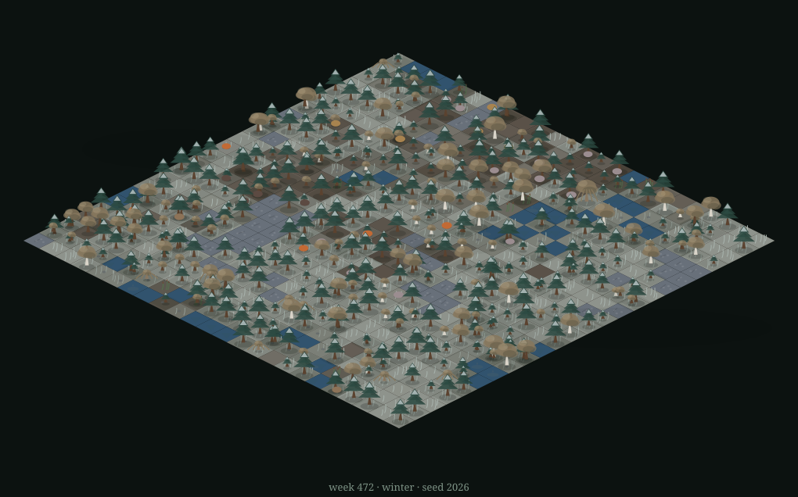

# Grove — a self-contained forest, operated by a small local LLM

<p align="center"></p>

A living forest biome that runs entirely on your machine: ponds, pines,
willows, berry glades, grass, mushrooms — and rabbits, deer, foxes, owls,
robins and boars living, hunting, starving and being born through the
seasons. A small local language model is the **World Soul**: every few
weeks it decides which fate befalls the woods (a storm, a drought, a
blight, a bloom, a passing wolf...), its words become the chronicle, and
it names the newborns.

No cloud. No API keys. State lives in one SQLite file. Zero pip
dependencies — the engine is pure Python stdlib, the model runs in Ollama.

```
WEEK 41 · SPRING · 🌧 rain   🐇38 🦌16 🦊9 🦉4 🐦22 🐗6
🌲 🌲 🌱 🟫 🌲 🟨 🌲 🌱 🌳 🌳 ... [24×24 emoji map] ...
 ☾ SOUL ▸ storm NW — "A cold wind is gathering over the western pines."
   ▸ A fox took a wild rabbit at the pond's edge.  (1wk ago)
   ▸ 2 boar slipped in from beyond the forest edge.  (5wk ago)
```

## Requirements

- Python 3.11+ (stdlib only)
- [Ollama](https://ollama.com) running locally

## Quick start

```sh
./grove.sh new --seed 42        # plant a grove (deterministic, no LLM)
./grove.sh run                  # watch it live (LLM in the background)
```

Keys in watch mode: `space` pause · `s` step · `n` invite the soul now ·
`q` quit. Nothing is ever lost — every week is saved to SQLite.

## Viewing it from another device

`grove web` serves a live dashboard over plain HTTP — no build step, works
offline, one hand-written page. It is a **full-screen HUD**: the isometric
map fills the window and the controls float as translucent panels that
**fade away after a few still seconds** — only the grove remains. The
scene: a floating earth slab, diamonds shaded by season and moisture,
procedural pines/birches/willows swaying and occluding each other
depth-sorted, creatures gliding to their weekly cells with soft shadows
(birds hover above theirs), rain and snowfall, lightning in storms,
autumn leaf-drift, name tags over named souls, and Diamond washes where
the soul's effects are active. Click a named creature for its biography
(born → named → hunted → remembered) with a follow-cam; ask the grove
questions and it answers from the world's own history. Keys: `space`
pause · `s` step · `n` invite the soul · `f` fullscreen · `c` calm.
`?plain` (or no canvas) falls back to the emoji page.

```sh
./grove.sh web                  # loopback only (for an ssh tunnel)
./grove.sh web --public         # reachable from any device on the LAN
```

- **Same network (LAN):** with `--public`, open `http://<this-box-ip>:8787`
  on a phone or laptop. (`hostname -I` shows the address.)
- **Anywhere, if you use Tailscale:** with `--public`, the box's
  Tailscale address (`tailscale ip -4`) works from any tailnet device.
- **Or tunnel, without opening the port:** plain `grove web` (loopback),
  then `ssh -N -L 8787:localhost:8787 yakov@<this-box>` and open
  `http://localhost:8787` on the other machine.
- **No browser at all:** `ssh` in and run `./grove.sh run` inside
  `tmux` (or `nohup ./grove.sh web & > grove.log`) — the terminal view is
  the same world, and detach/reattach as you like.

Leave it running detached with `tmux` (recommended) or
`nohup ./grove.sh run-forever 2>&1` style scripts; use `cron`/`systemd`
if you want the grove to wake up on boot.

```sh
./grove.sh step 200 --offline   # simulate 8+ years headless, fast
./grove.sh map                  # render the current map
./grove.sh status               # population history with sparklines
./grove.sh chronicle --all      # the whole chronicle (☾ = LLM-written)
```

`grove.sh` is just `python3 -m grove`; run it from the repo root instead
if you prefer.

## The model

Small-model reality: on a ~2 GHz 4-core CPU there is no GPU and inference
is CPU-bound — ~1.9 tok/s generation on Llama-3.2-3B. The defaults are
tuned for slow silicon:

- **`--tier local` (default): fully offline.** The soul and the naming
  voice run on `llama3.2:3b` (best judgment/prose, ~20–60 s warm per
  turn), the chronicle on `llama3.2:1b` (~5–8 s per line) — two models
  kept resident, swapping the slower one out automatically after two bad
  calls.
- **`--tier cloud`**: a fast, richer soul (~1–2 s per decision) through
  the same Ollama, still gated by the same schema validation, and falling
  back to local on any failure.
- The world never waits on the model: the sim ticks happily while the
  soul ponders, and results land at the next week boundary.

`grove run --offline` (or a missing/unreachable model) gives the same
world with deterministic template prose instead of LLM prose.

## How it stays robust (the one design rule)

> The simulation engine owns ALL state. The LLM never holds the world in
> context and never writes world state. It gets small, bounded jobs with
> schema-validated outputs and deterministic fallbacks.

- **World Soul** — roughly one decision every few minutes (wall time):
  a ≤ 400-token digest → one JSON decision from an enumerated menu
  (`storm, drought, blight, bloom, migration, visitor, destiny, quiet`),
  applied by validated, deterministic rules. Nonsense in → `quiet` out.
  Ollama down → `quiet`.
- **Chronicler** — notable events are described by template lines the
  instant they happen; a background call rewrites them when the model is
  ready (☾), rejecting lines that hallucinate off-event, restate the
  data, or echo recent lines. Same-week stories fold into one counted
  line ("5 pines are fallen — great age"). Every line is cached by
  event signature, so replays and
  `--offline` runs cost nothing.
- **Voice** — newborns and elder trees get names (one-word JSON, charset
  validated, list fallback), sometimes with a one-line diary.

The engine (`grove/sim.py`) is fully deterministic per seed: same seed +
same actions ⇒ same world. Tuning constants sit at the top of that file;
the food web is gated by `tools/balance.py` (many seeded worlds × years,
all species must persist).

## Layout

| path | role |
|---|---|
| `grove/world.py` | state containers, species tables, helpers |
| `grove/gen.py` | seeded worldgen (no LLM) |
| `grove/sim.py` | the tick engine + validated operator effects |
| `grove/events.py` | which events are chronicle-worthy |
| `grove/operator.py` | World Soul: digest, menu schema, validation |
| `grove/chronicler.py` | narration prompts + template fallbacks |
| `grove/voice.py` | naming |
| `grove/memory.py` | ask-the-grove: chronicle retrieval + answer |
| `grove/llm.py` | Ollama client (schema chats, per-job model chains) |
| `grove/render.py` | the emoji map + header + chronicle feed |
| `grove/db.py` | SQLite: world, stats, events, chronicle, cache, biographies |
| `grove/app.py` | shared runner (used by CLI and web) |
| `grove/web.py` | the full-screen isometric dashboard (one HTML page) |
| `grove/__main__.py` | CLI + run loop |
| `tools/balance.py` | the ecologist's gate: 8 worlds × 10 years, all must pass |
| `tools/check_page.py` | headless verification of the served page |
| `tools/render_svg.py` | the README's scene, rendered from the live world |

## Ideas on the shelf

- playable character mode (walk in and talk to the animals)
- the time-travel scrubber (replay any stretch of the world's past)
- an offline soundscape: procedural wind, rain and a distant wolf
- the book of grove: seasonal reflections + a saga export
- seasons' effect on names ("the winter fox"), wolf packs, bear dens